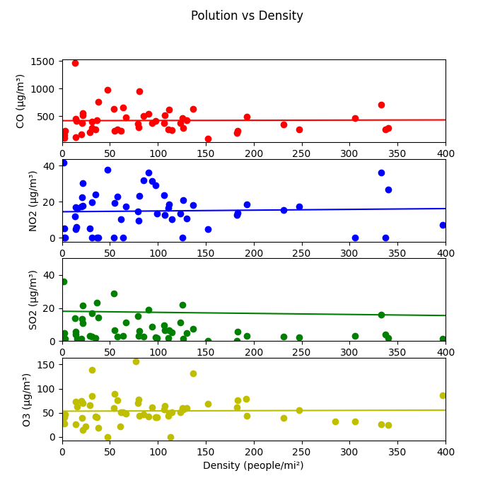

# Data Report

## Question

Is the amount of air pollutants dependant on the population density of a certain county?

## Data Sources

### Population Density Data ([www.kaggle.com](https://www.kaggle.com/datasets/fernandol/countries-of-the-world#))

I chose this datasource because it contains exactly the data that I need. I needed a source for the population density of all countries in the world. The datasource contains the data in a structured format, to be exact a csv file. This datasource not only contains the population density of each country but also other key figures, however this is not a problem since I can remove them in my data pipeline. However, the data is not completly up to date as the data was last updated in 2018. Unfortunately I was not able to find a more current datasource for the population density of each county. In order to download the data you need to be signed in, which is why I predownloaded the file and put it inside of the git repository. The datasource is licensed under a "CC0: Public Domain"-license, which means that there is no copyright on the data and there is no need to state the source in your project which makes it trivial to fulfill the requirements of this license.

### Pollution Data ([www.public.opendatasoft.com](https://public.opendatasoft.com/explore/dataset/openaq/table/?disjunctive.city&disjunctive.location&disjunctive.measurements_parameter))

I chose this datasource as it features a lot of data about multiple pollutants in a very broad range of countries in order to get a represantative amount of data points. This datasource also contains structured data in form of a csv file, which can be downloaded without logging in. This datasource contains not only the considered air pollutants (CO, NO2, SO2, O3) but als many other pollutants. The other pollutants will be excluded from the data in the data pipeline. The quality of the data is not always perfect as it seems. For example there are records where the ammount of air pollutants in the air is negative which is quite obviously not possible. Thre are also records where the ammount is unsual high. This could be because of faulty data, but it may also be that does measuring stations are located directly near a highly polluting source and the value is therefore very high. However does extreme value deviations will be dealt with in the data pipeline. This datasource is lisenced under a CC BY 4.0 License, which means that the datasource is free to use when appropriate credit is given, by making an attribution. I plan to give this attribution by mentioning the source of my data in this data-report, but also inside of the final-report. 

## Data Pipeline
### pipline.sh

This shellscript deletes the daatabase, if already present, and then executes the three parts of the data pipeline.

### pipeline.jv

This first part of the pipeline is a Jayvee pipeline. 

Inside this pipeline the Pollution Data is downloaded and then transformed to fit the needs for my project. Inside of the pipline I filter the columns of the datasource that I need. I also constrain the type of data, that I want to be included in my final Dataset, which means I filter for the records containing the analysed pollutants. I also make sure, that only "clean" data will be futher transformed by making sure, that all values are inside of a resonable range. In order to make analysing the data easier I only take the records that have the unit "µg/m³". This datasource is also updated regularly, however the structure of the data should stay, the same so that the pipeline can handle the changing data. A problem would be if the most common unit changes, because then most of the data would be ommited and not be considered during the analysis. However this is not to be expected.

The Dataset about the contries of the world is already downlaoded and therefore only is transformed inside of the pipeline. I only take the two columns that I need which are the name of the country and its population density in the unit of "People per sqaure mile". Because of the data fits nicely to the shape that I need for my project there are no more alterations that need to be done. 

Both datasets are then stored inside to seperate tables of a sqlite database so that I can further form the data to the way I need it by making SQL calls.

### pipeline2.py

The second part of the pipeline is written in Python. By making use of the sqlite3 libary, I can create my final dataset that is then used as the result of my datapipeline. Inside of this pipeline I first need to make sure to have only a single value per country in order to make comparisions. In order to do so, I create a View, that contains the average value of each pollutant for each country. Afterwards I join the average values with the population density in order to get my final data, which is then safed inside of a new table in the sqlite database.

### plot.py

This Python file is not really part od the datapipeline, however it produces plots which make the data much more vivid then looking at a raw, database. Inside of this file I use sqlite3 and pandas in order to query the database. For calculating a linear regression of the data in order to beeing able to see a trend inside of the data I use the LinearRegression module of the sklearn.linear_model library. In order to automatically create the plots I use matplotlib.pyplot.

## Result and Limitations

The output of the datapipeline is a sqlite database table with the corresponding values. As stated before I ploted those values. Those plots are shown on the next page.

The results of my pipeline is structured data in form of a sqlite database table. By always downloading the current pollution data it is also mostly up to date. The population density of a country usually is not very fluctuating therefore it is okay that this data is not always 100% up to date. The accuracy of my results is not the best as it for calculating the the amount of air pollutants, I take the average of each station. This however is quite obiously not the real average amount that is in the air of that county, but it should be at least representative and relative to the "real" average. The Data is also not complete as it does not feature of the data for each county. However it features a representative amount of about 40 countries. The resulting data is very relevant for the question of this project as it is needed to answer it. 

## Attributions

Thanks to [OpenAQ](https://public.opendatasoft.com/explore/dataset/openaq/information/) for the datasource air pollution.
